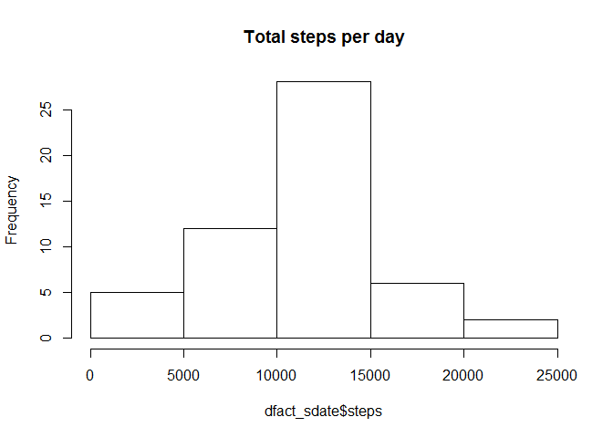
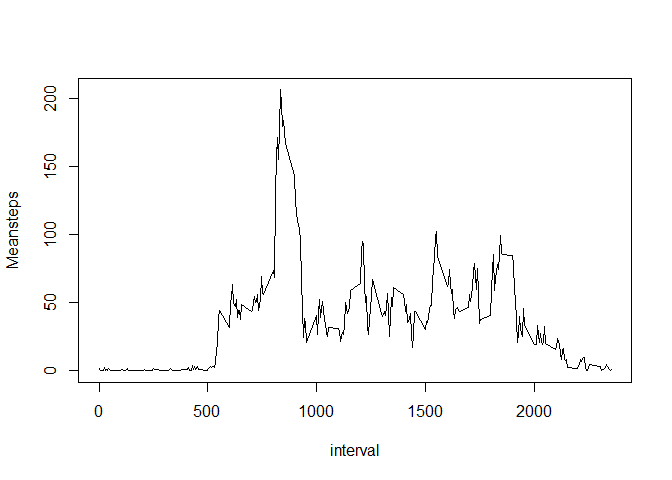
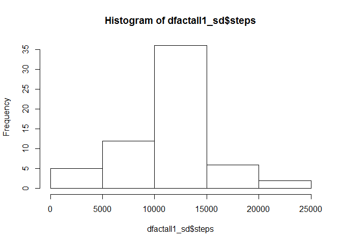
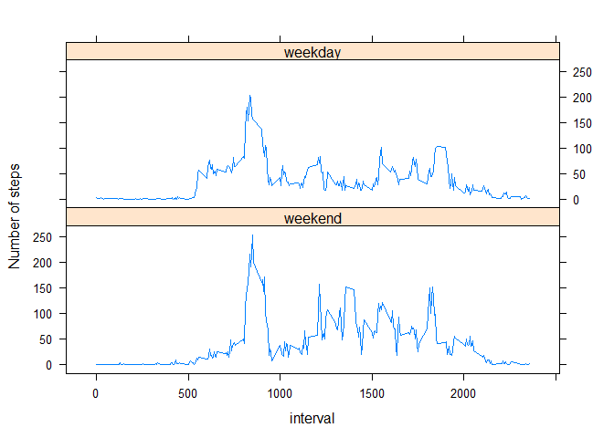

# Reproducible Research: Peer Assessment 1

## Loading and preprocessing the data
1. Set the working Directory where you wish to copy the data. 
2. We are creating file_url and then using that file url to download data from                [Web](https://d396qusza40orc.cloudfront.net/repdata%2Fdata%2Factivity.zip).
3. Download the Data and give it appropriate file name.
4. Load the Data into a dataframe.
5. Kindly change the *method attribute* in download.file method, if you are not using windows machine. you can either delete it  
    or use *method="curl"*
    

```r
library(dplyr)
```

```
## 
## Attaching package: 'dplyr'
## 
## The following objects are masked from 'package:stats':
## 
##     filter, lag
## 
## The following objects are masked from 'package:base':
## 
##     intersect, setdiff, setequal, union
```

```r
setwd("C:\\Arora\\RProgramming\\Reproduceble")
file_url<-"https://d396qusza40orc.cloudfront.net/repdata%2Fdata%2Factivity.zip"
download.file(file_url,destfile = "activity.zip",method = "wininet")
unzip("activity.zip")
file_name<-list.files(pattern = "*.csv")
dfactAll<-read.csv(file_name,stringsAsFactors = FALSE)
dfactAll$date <- as.Date(dfactAll$date,"%Y-%m-%d")
```
## What is mean total number of steps taken per day?
-   we are filtering out the records which do not have measurements for Steps taken.
-   Grouping the rest of Data on Date and then Summing up the steps for all the intervals per day.
-   Drawing histogram with total number of steps per day as base.


```r
dfact <- dfactAll[!is.na(dfactAll$steps),]
dfact_gdate <-  group_by(dfact, date)
dfact_sdate <-  summarise(dfact_gdate,sum(steps))
colnames(dfact_sdate) <- c("date","steps")
hist(dfact_sdate$steps, main = "Total steps per day")
```

 
## What is the average daily activity pattern?
-   Displaying the median of Total Number of steps taken per day
-   Displaying the Mean of Total Number of steps taken per day
-   Drawing a graph with mean number of steps on basis of per interval


```r
medStepsDay<-median(dfact_sdate$steps)
print(c("Median steps per day with NA Excluded = ",medStepsDay))
```

```
## [1] "Median steps per day with NA Excluded = "
## [2] "10765"
```

```r
print
```

```
## function (x, ...) 
## UseMethod("print")
## <bytecode: 0x0000000013d7a5e8>
## <environment: namespace:base>
```

```r
meanStepsDay <- mean((dfact_sdate$steps))
print(c("Mean steps per day with NA Excluded = ",meanStepsDay))
```

```
## [1] "Mean steps per day with NA Excluded = "
## [2] "10766.1886792453"
```

```r
dfact_ginterval<-group_by(dfact, interval)
dfact_minterval <- summarise(dfact_ginterval,mean(steps))
colnames(dfact_minterval) <- c("interval","Meansteps")
with(dfact_minterval, plot(interval, Meansteps,type = "l"))
```

 

```r
dfactMaxInt<-dfact_minterval$interval[dfact_minterval$Meansteps==max(dfact_minterval$Meansteps)]
print(c("Interval with maximum number of average steps is : ",dfactMaxInt))
```

```
## [1] "Interval with maximum number of average steps is : "
## [2] "835"
```

## Imputing missing values
- Adding another column as Mean number of steps taken per interval mapped on interval column.
- Reason for choosing mean of steps on Interval instead of Steps on Date is because of no measurement          of steps taken on a few days, which would have resulted into mean as NA as well.
- Filling the NA values with mean values for the inerval.
- There is no difference in mean steps between before and after filling missing values.
- There is slight difference in median steps between before and after filling median values.


```r
dfactall1<-merge(dfactAll,dfact_minterval,by.x="interval",by.y="interval")
dfactall1$steps<-ifelse(is.na(dfactall1$steps),dfactall1$Meansteps,dfactall1$steps)
dfactall1<- dfactall1[,1:3]
dfactall1_gd<- group_by(dfactall1,date)
dfactall1_sd<- summarise(dfactall1_gd, sum(steps))
colnames(dfactall1_sd) <- c("date","steps")
hist(dfactall1_sd$steps)
```

 

```r
dfactall1_meand <- mean(dfactall1_sd$steps)
print(c("Mean number of steps per interval after filling in missing values = ", dfactall1_meand))
```

```
## [1] "Mean number of steps per interval after filling in missing values = "
## [2] "10766.1886792453"
```

```r
dfactall1_medid <- median(dfactall1_sd$steps)
print(c("Median number of steps per interval after filling in missing values = ", dfactall1_medid))
```

```
## [1] "Median number of steps per interval after filling in missing values = "
## [2] "10766.1886792453"
```

## Are there differences in activity patterns between weekdays and weekends?
- Dividing  the filled in dataframe on 2 categories of *weekday* and *weekend*
- Assigning value of weekend if weekday, obtained through wday function of lubridate package, is **6** or **7**, otherwise  
    marking it as weekday.
- printing plot using xyplot for mean number of steps taken per interval in 2 panels, one for each *weekend* and *weekday*.
- By Comparing We can deduce that on average number of steps taken on weekend are more comared to weekday.

```r
library(lubridate)
library(lattice)
dfactall1$wDay <- factor((wday(dfactall1$date) %in% 1:5), levels=c(FALSE, TRUE), labels=c('weekend', 'weekday'))
dfactall1_giw <- group_by(dfactall1,interval, wDay)
dfactall1_miw <- summarize(dfactall1_giw, mean(steps))
colnames(dfactall1_miw) <- c("interval","wDay","steps")
p<-xyplot(steps~interval|wDay, data =dfactall1_miw, type="l",ylab="Number of steps", layout = c(1,2))
print(p)
```

 
